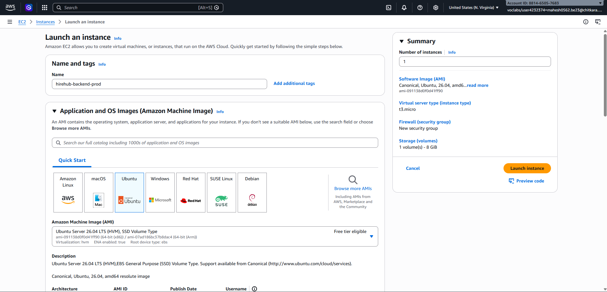
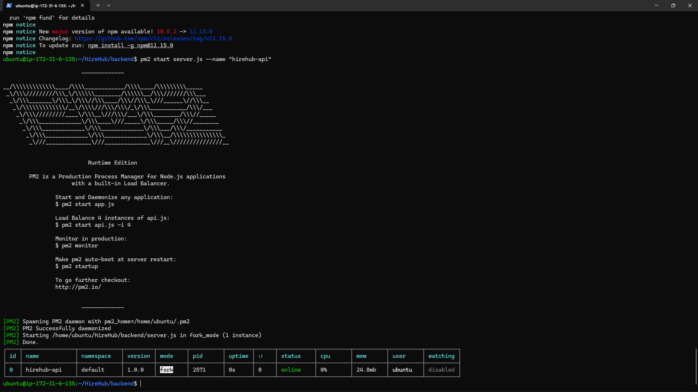
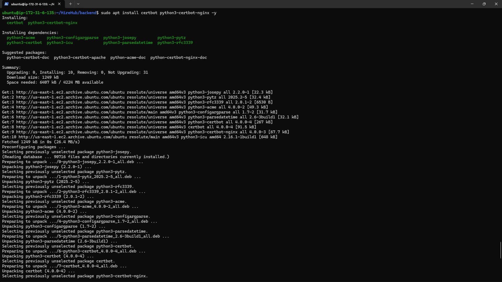
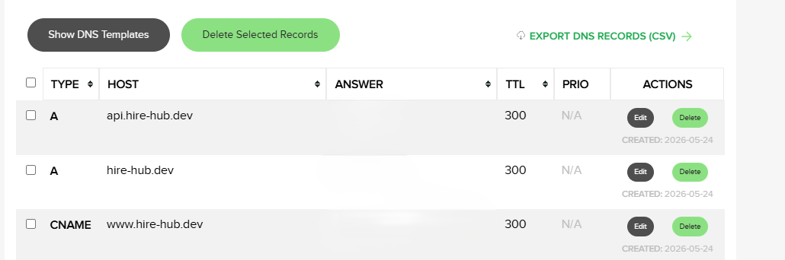
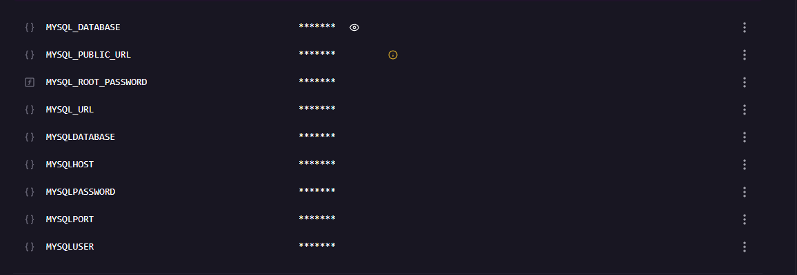
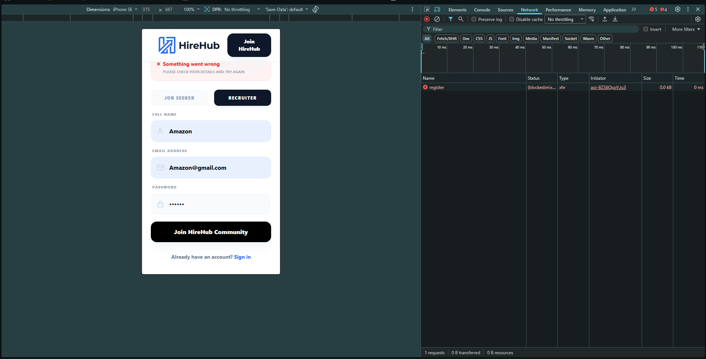
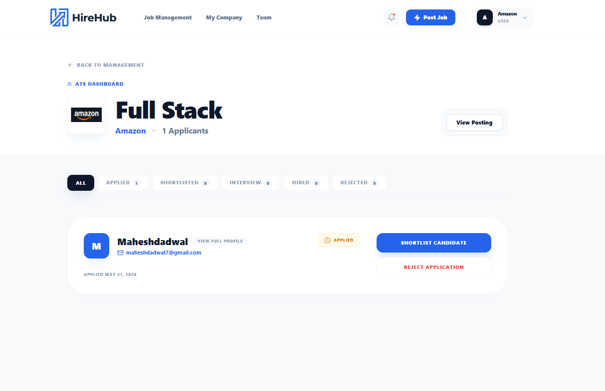
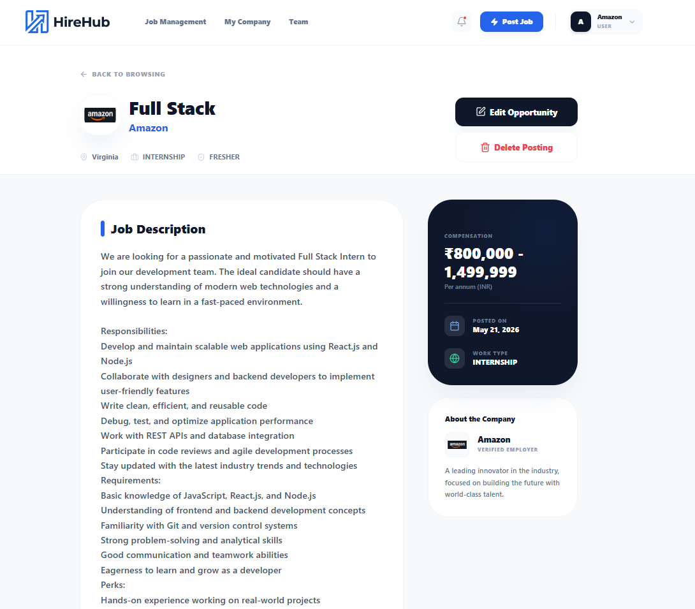

# HireHub – Production Deployment on AWS EC2

A full-stack job portal platform built using React.js, Node.js, Express.js, MySQL, and Railway database deployment with production hosting on AWS EC2 using PM2, Nginx, SSL, and custom domain configuration.

---

# Project Overview

HireHub is a full-stack recruitment platform where recruiters can post jobs and manage applicants while job seekers can apply for jobs, manage profiles, and upload resumes.

The project was deployed in a production-like environment using AWS EC2, PM2, Nginx reverse proxy, SSL certificates, custom domains, Railway MySQL database hosting, and Vercel frontend hosting to gain hands-on experience with real-world deployment workflows and backend infrastructure management.

---

# Tech Stack

## Frontend
- React.js
- Vite
- Tailwind CSS
- Axios

## Backend
- Node.js
- Express.js

## Database
- MySQL
- Railway (Hosted Database)

## Deployment & DevOps
- AWS EC2 (Ubuntu)
- PM2
- Nginx
- Certbot SSL
- Vercel
- Custom Domain + DNS Configuration

---

# Features

- Recruiter & Job Seeker authentication
- Job posting & application system
- Resume upload & download
- Profile management
- Recruiter dashboard
- Application status tracking
- Protected routes using JWT
- Responsive UI
- Production deployment setup

---

# System Architecture

```bash
Frontend (Vercel)
        ↓
hire-hub.dev
        ↓
API Requests
        ↓
api.hire-hub.dev
        ↓
Nginx Reverse Proxy
        ↓
Node.js Backend (PM2)
        ↓
Railway Hosted MySQL Database
```

---

# Production Deployment Experience

## 1. AWS EC2 Setup

Created and configured an Ubuntu EC2 instance on AWS.

Installed:
- Node.js
- PM2
- Nginx
- Git

Configured security groups and opened required ports for:
- HTTP (80)
- HTTPS (443)
- Backend API
- SSH access

### Commands Used

```bash
sudo apt update
sudo apt install nginx
curl -fsSL https://deb.nodesource.com/setup_20.x | sudo -E bash -
sudo apt install -y nodejs
sudo npm install -g pm2
```




(Add:
- EC2 dashboard
- Security groups
- PM2 status)

---

## 2. Backend Deployment

Cloned the backend repository into the EC2 server and configured environment variables for production deployment.

Used PM2 process manager to keep the backend running persistently even after crashes or server restarts.

### Commands Used

```bash
git clone <repository-url>
cd HireHub/backend
npm install

pm2 start server.js --name "hirehub-api"
pm2 save
pm2 startup
```



---

## 3. Nginx Reverse Proxy & HTTPS Setup

Configured Nginx as a reverse proxy to route incoming HTTPS traffic to the Node.js backend running on localhost.

Enabled HTTPS using Let's Encrypt SSL certificates through Certbot.

### Commands Used

```bash
sudo certbot --nginx -d api.hire-hub.dev
```

This solved browser mixed-content blocking issues caused by insecure HTTP API requests from the HTTPS frontend.





---

## 4. Elastic IP Configuration

Configured Elastic IP to prevent backend downtime caused by public IP changes after restarting the EC2 instance.


## 5. DNS & Domain Configuration

Configured custom domain DNS records to connect:
- Frontend domain with Vercel
- Backend API subdomain with AWS EC2

The backend API was exposed through:

```bash
api.hire-hub.dev
```





---

## 6. Railway MySQL Database Integration

Used Railway to host the production MySQL database.

Configured secure environment variables inside the backend for:
- Database host
- Username
- Password
- Database connection URL

Connected the AWS-hosted backend with Railway MySQL for production database access.





---

# Challenges Faced

## Challenge 1 — Mixed Content Error

The frontend was deployed on HTTPS while the backend API was initially running on HTTP.

Modern browsers blocked API requests due to mixed-content security restrictions.

### Solution

Configured SSL certificates using Certbot and migrated API communication to HTTPS.





---

## Challenge 2 — EC2 Public IP Change

Restarting the EC2 instance changed the public IP address, which broke API communication and DNS mapping.

### Solution

Configured and associated an Elastic IP with the EC2 instance for a permanent backend IP address.

---

## Challenge 3 — Hardcoded Backend URLs

Some frontend components contained hardcoded backend IP addresses which caused deployment inconsistencies.

### Solution

Replaced hardcoded URLs with environment variables and dynamic API configuration.

Example:

```javascript
const api = axios.create({
    baseURL: import.meta.env.VITE_API_URL,
});
```

---

## Challenge 4 — Production Database Connectivity

Connecting the AWS backend with the Railway-hosted MySQL database required proper environment variable management and secure production configuration.

### Solution

Configured environment variables properly and validated database connectivity in production deployment.

---

# What I Learned

Through this deployment process, I gained practical experience in:

- AWS EC2 server management
- Linux terminal workflows
- PM2 process management
- Nginx reverse proxy configuration
- SSL & HTTPS setup
- DNS management
- Railway database hosting
- Production debugging
- Environment variable management
- Frontend-backend communication in production
- Handling real-world deployment issues

---

# Screenshots

## 1. Home Page


---

## 2. Recruiter Dashboard


---

## 3. Job Application Page


---

## 4. AWS EC2 + PM2 Status


---

## 5. SSL Certificate Setup


---

## 6. DNS Configuration


---

## 7. Railway MySQL Dashboard


---

## 8. Mixed Content Error Fix


---

# Live Deployment Note

The project was previously deployed using:
- Vercel for frontend hosting
- AWS EC2 for backend hosting
- Railway for MySQL database hosting
- Custom domain + HTTPS setup

The deployment was created primarily to gain hands-on production deployment experience and infrastructure understanding.

---

# Conclusion

This project helped me understand how full-stack applications are deployed and maintained in production environments, along with the challenges involved in infrastructure setup, HTTPS configuration, reverse proxies, deployment debugging, and production database connectivity.
